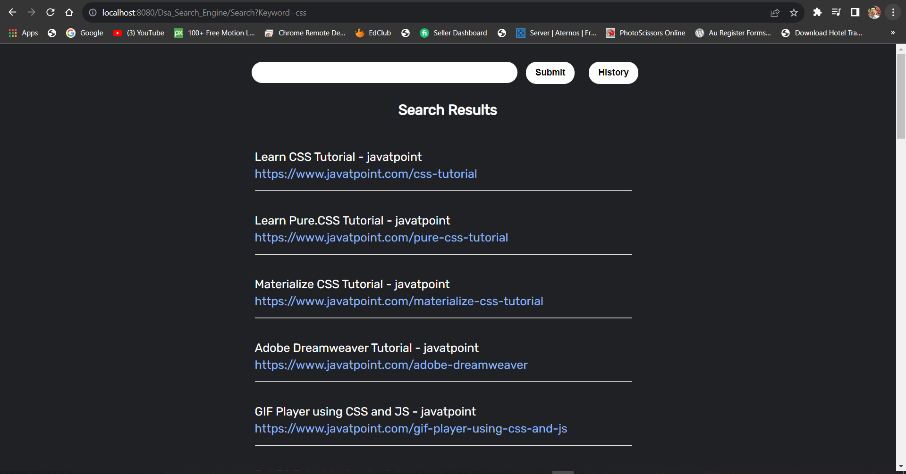
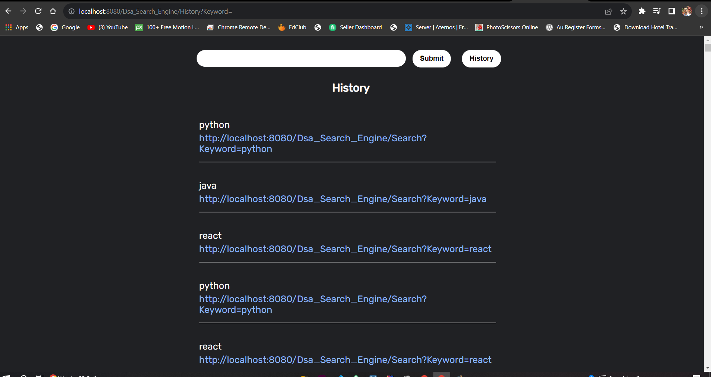

# Search-engine-using-DFS


Home Screen


Search Results


History

## Overview

This is a search engine project that allows users to search for relevant information and retrieve the top 30 search results based on their queries. The project incorporates a web crawler using the Depth-First Search (DFS) algorithm to navigate web pages and collect data for indexing.

## Features

- User-friendly web interface for search queries.
- DFS-based web crawler to collect data from web pages.
- Search history tracking and display.
- Database integration with MySQL to store and retrieve search data.

## Technologies Used

- HTML, CSS for front-end development.
- Java, Servlets, and JSP for back-end implementation.
- MySQL for database management.

## Setup

1. Clone the repository:

```bash
git clone  https://github.com/sahildongre20/Search-engine-using-DFS
cd search-engine-project
